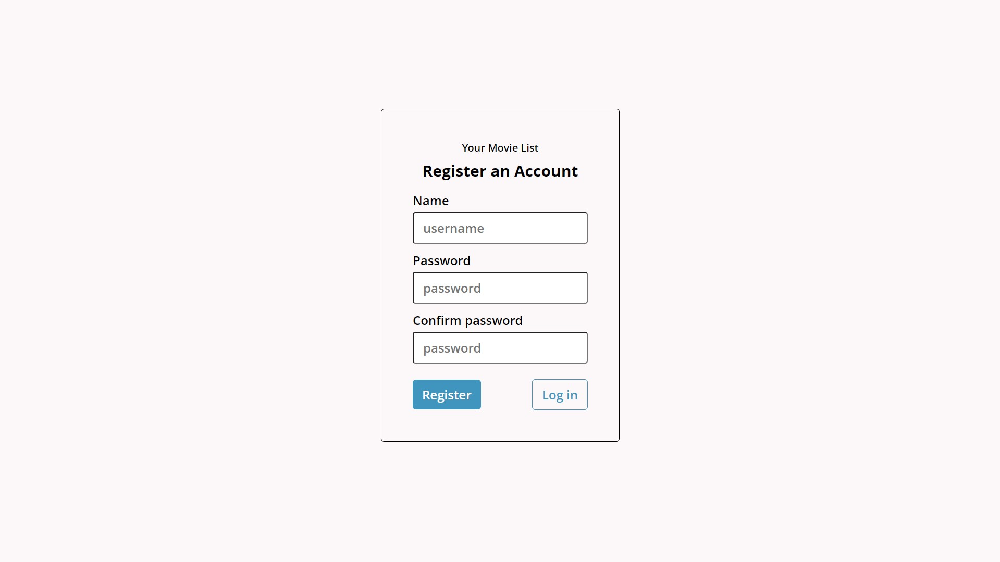
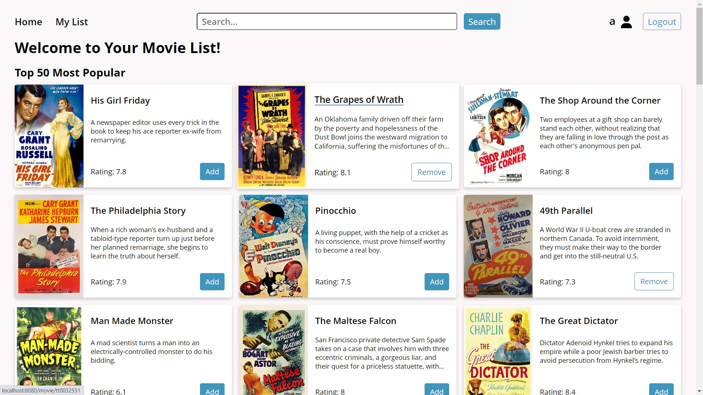
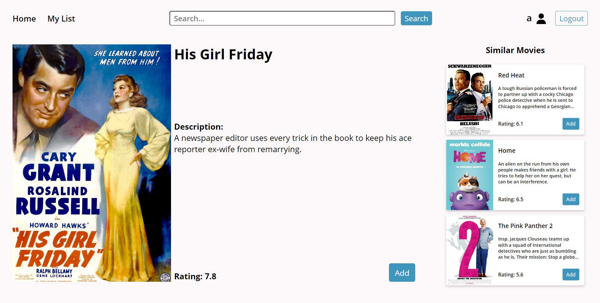
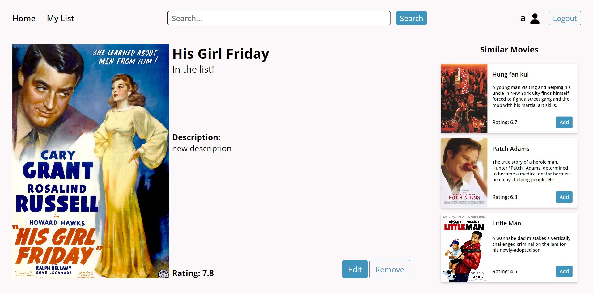
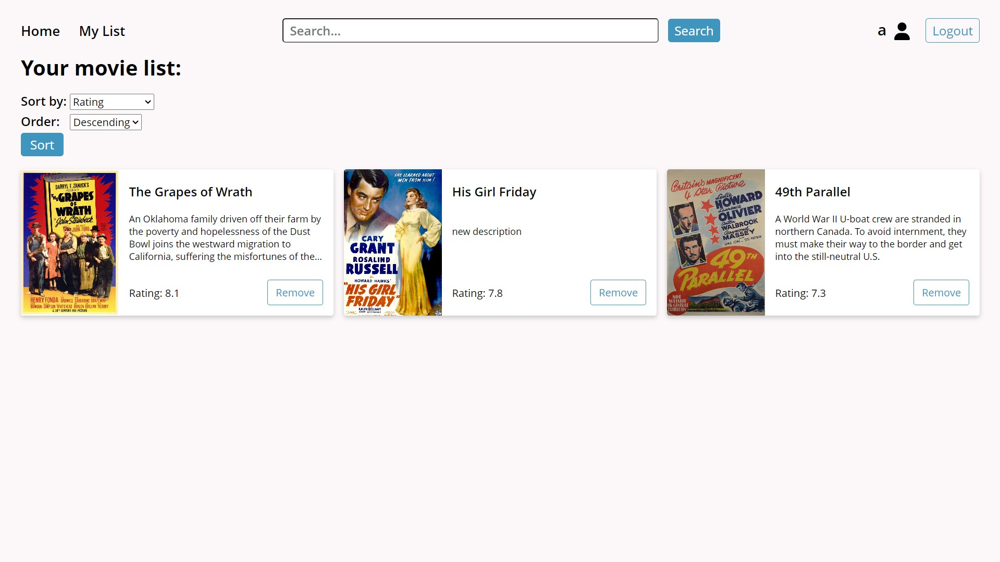
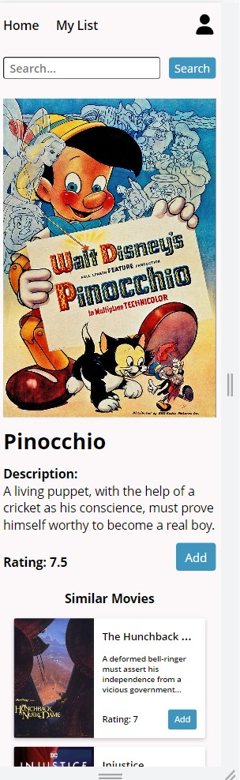
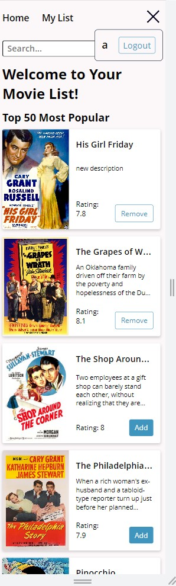

# Your Movie List
Save your favorite movies and give them your own description!

## Table of contents

- [Overview](#overview)
  - [Functionality](#functionality)
  - [Installation](#installation)
  - [Video Demo](#video-demo)
  - [Screenshots](#screenshots)
- [About the Project](#about-the-project)
  - [Built with](#built-with)
  - [Project structure](#project-structure)
  - [Purpose](#purpose)
  - [Continued development](#continued-development)
- [My Process](#my-process)
    - [Inspiration](#inspiration)
    - [What I learned](#what-i-learned)
    - [Learning process](#learning-process)

## Overview

### Functionality
The app allows the user to:
 - Register an account
 - Login to their account
 - View and search for movies
 - Add movies to their account
 - View their list of movies
 - Edit the description of the movie that they saved
 - Delete movies from their account (description is reset to default)

### Installation

Make sure to have npm installed

Clone the repository 
```bash
git clone https://github.com/Vladmidir/Your-Movie-List.git
cd Your-Movie-List
```

Install the dependencies

```bash
npm install
```

CD into the client folder, install client dependencies, and build the react app
```bash
cd client
npm install
npm run build
cd ..
```

Create a [RapidAPI](https://rapidapi.com/) account and get a RapidAPI Movies Database key from [here](https://rapidapi.com/SAdrian/api/MoviesDatabase/).

Add your RapidAPI key to a `.env` file and source it

> ./server/.env
>```
> export RAPIDAPI_KEY='yourkey'
>```


```bash
source ./server/.env
```

From the project root folder start the server

```bash
npm start
```

Check the `http://localhost:8080/` or the port displayed in your terminal.


### Video Demo

https://github.com/Vladmidir/Your-Movie-List/assets/121591697/5c632312-f4c9-44fc-8f8c-c5ee37178e3f


### Screenshots
Register

Homepage

Movie Page

Saved Movie

My List

Movie Page Mobile

Homepage Mobile



## About the project

### Built with
- Node JS (express) ADD LINKS HERE
- React (React Router)
- Sequelize ORM (sqlite3)
- HTML
- CSS

### Project structure
The project uses React client-side rendering along with an Express server.


Whenever a request is sent to the server that does not match any server routes, the server redirects the request to the client
('client/build/index.html'). All of the rendering is done by the client.


The server contains authentication POST routes for recording and authenticating the user. 
Along with authentication, the server has the **movie** API. The movie API manages the CRUD operations for the local database.
The initial data for the movie is retrieved by the movie API from [RapidAPI MoivesDatabase](https://rapidapi.com/SAdrian/api/MoviesDatabase/).
When a user adds a movie to their list, a record is created in the database. The information about the movie is now stored locally along with the UserId of the user that saved the movie (one-to-many relationship). When querying for a movie, the server first checks the local database for if the user has saved the corresponding movie. If the user has not saved the movie, the data from RapidAPI MoviesDatabase is then returned.

#### Here is an abstract diagram of the project configuration


> **Note:** I refered to server-client communications as "REST API", when in fact it may not be quite RESTful.

### Concerns
After finishing the project I am slightly concerned that the API I have implemented is not quite RESTful.
<br />
I am not sure whether I can call the API I have implemented RESTful for two reasons:
1. I am worried that passport.js middleware counts as a server state (a REST server has to be stateless).
2. I suspect that displaying varying movie pages for different users (different descriptions) violates the uniformity principle of REST.

### Purpose
The general purpose of this project was for me to learn how to make a **full-stack** application with a **database (CRUD)** and **user authentication** system.

### Continued Development
One feature that could make sense and would make a good challenge is adding the ability for a user to send friend requests to others and view their friend's movie lists.

## My Process

### Inspiration 
The inspiration came from the [Project Ideas List](https://gist.github.com/MWins/41c6fec2122dd47fdfaca31924647499). 
I liked the MyTop100Movies project idea and implemented my version of it.

### What I Learned
This is currently my biggest project. Working on it has taught me a lot of things and I would not be able to list every single one of them. However here is a brief list of some of the things I learned:
- How to configure an Express server.
- How to set up server-client communications.
- How to use React Router for client-side routing.
- How to use Passport.js for local authentication.
- How to use Sequelize to create and interact with a database.
  - Create database models. Set-up relationships.
- How to configure larger projects (break down the code into separate files and folders)
- Improved CSS skills (navbar and card designs)

### Learning Process
For the technologies that were new to me (React Router, Sequelize, Express) I mostly followed the official documentation.
Other tutorials, for more specific problems, were mostly written. 
Nonetheless, I did find a couple [Web Dev Simplified](https://www.youtube.com/c/webdevsimplified) videos quite useful. 
Especially for some of the CSS designs and Passport.js authentication.
