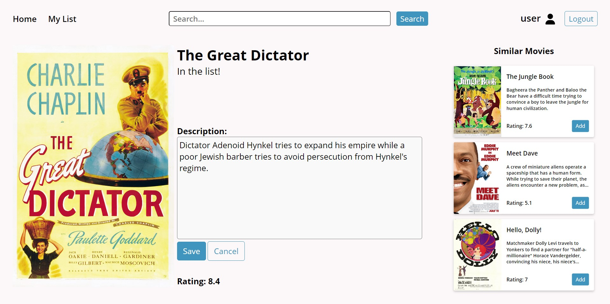
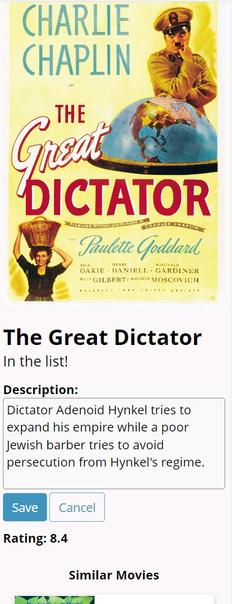

# Your Movie List
**Save your favorite movies and give them your own description!**

Responsive full-stack website using [React](https://react.dev/) & [Node.js](https://expressjs.com/). The website supports user authentication with [Passport.js](https://www.passportjs.org/) allowing users to register, login and create personalized lists of movies.

The project includes an SQL database with one-to-many relationship configured with [Sequelize ORM](https://sequelize.org/).

A [CRUD API](https://www.logicmonitor.com/blog/rest-vs-crud#crud) allows users to edit movies in their list. An external movie library is connected with [RapidAPI](https://rapidapi.com/SAdrian/api/moviesdatabase) to fetch the initial data about movies.

Universal API interface automatically fetches movie data depending on the movie status. That is, a local database if the movie is saved, or the external API otherwise.
<details open>
<summary>

## Table of contents 
</summary>

- [Overview](#overview)
  - [Functionality](#functionality)
  - [Video Demo](#video-demo)
  - [Screenshots](#screenshots)
  - [Installation](#installation)
- [About the Project](#about-the-project)
  - [Built with](#built-with)
  - [Project structure](#project-structure)
  - [Why not RESTful?](#why-not-restful)
  - [Continued development](#continued-development)
- [My Process](#my-process)
    - [Inspiration](#inspiration)
    - [Purpose](#purpose)
    - [What I learned](#what-i-learned)
    - [Learning process](#learning-process)

</details>

## Overview

### Functionality
The app allows the user to:
 - Register & login to an account
 - View movie descriptions and search for movies
 - Add movies to their list & view their list of movies
 - Edit the description of each movie that they saved
 - Delete movies from their list (description is reset to default)

### Video Demo

https://github.com/Vladmidir/Your-Movie-List/assets/121591697/5c632312-f4c9-44fc-8f8c-c5ee37178e3f

### Screenshots
<details>
<summary>Register</summary>


</details>

<details>
<summary>Homepage</summary>


</details>

<details>
<summary>Movie Page</summary>


</details>

<details>
<summary>Saved Movie</summary>


</details>

<details>
<summary>Editing a Movie</summary>


</details>

<details>
<summary>My List</summary>


</details>

<details>
<summary>Movie Page Mobile</summary>


</details>

<details>
<summary>Edit Movie Mobile</summary>


</details>

<details>
<summary>Homepage Mobile</summary>


</details>

### Installation

Make sure to have npm installed

Clone the repository 
```bash
git clone https://github.com/Vladmidir/Your-Movie-List.git
cd Your-Movie-List
```

Install the dependencies

```bash
npm install
```

CD into the client folder, install client dependencies, and build the react app
```bash
cd client
npm install
npm run build
cd ..
```

Create a [RapidAPI](https://rapidapi.com/) account and get a RapidAPI Movies Database key from [here](https://rapidapi.com/SAdrian/api/MoviesDatabase/).

Add your RapidAPI key to a `.env` file and source it

> ./server/.env
>```
> export RAPIDAPI_KEY='yourkey'
>```


```bash
source ./server/.env
```

From the project root folder start the server

```bash
npm start
```

Check the `http://localhost:8080/` or the port displayed in your terminal.


## About the project

### Built with
- [Node JS (express)](https://expressjs.com/)
- [React](https://react.dev/) & [React Router](https://reactrouter.com/en/main)
- [Sequelize ORM (sqlite3)](https://sequelize.org/)
- [HTML](https://developer.mozilla.org/en-US/docs/Web/HTML)
- [CSS](https://developer.mozilla.org/en-US/docs/Web/CSS)

### Project structure
The project uses React client-side rendering along with an Express server.

Whenever a request is sent to the server that does not match any server routes, the server redirects the request to the client
```js
app.get("*", (req, res) => {
  res.sendFile(path.resolve(__dirname, "../client/build", "index.html"))
})
``` 
All of the rendering is done by the client.

The server contains authentication POST routes for registering and authenticating the user. 

```js
app.post("/api/register", checkNotAuthenticated, async (req, res) => {
//some code...
}

app.post("/api/login", checkNotAuthenticated, passport.authenticate('local', {
  successRedirect: '/',
}))
//etc.
```

Along with authentication, the server has the `movie` API route. The `movie` route provides a **universal interface** for interacting with the local database (*supporting CRUD*) and the [RapidAPI MoviesDatabase API](https://rapidapi.com/SAdrian/api/moviesdatabase).

```js
const movies = require("./routes/Movie.router.js")
app.use('/api/movie', checkAuthenticated, movies)
```

Notice that the [Movie.router.js](./server/routes/Movie.router.js) does not contain any logic. All of the API & database managment logic is contained in [Movie.controlles.js](./server/controllers/Movie.controller.js) and is imported into the router.

The initial data for the movie is retrieved by the movie API from [RapidAPI MoivesDatabase](https://rapidapi.com/SAdrian/api/MoviesDatabase/).


When a user adds a movie to their list, a record is created in the [database](./server/database/index.js). The information about the movie is now stored locally along with the UserId of the user that saved the movie (one-to-many relationship). 

```js
// Create and Save a new Movie
exports.create = (req, res) => {
   // Validate request
   //NOTE: Other fields can be empty, due to the RapidAPI imperfections
   if (!req.body.title) {
    res.status(400).send({
      message: "Title can not be empty!"
    });
    return;
  }
  // Create a Movie. Add the UserId here.
  const newMovie = {
    title: req.body.title,
    description: req.body.description,
    imdb_id: req.body.imdb_id,
    rating: req.body.rating,
    banner: req.body.banner,
    genre: req.body.genre,
    UserId: req.user.id
  };

  // Save the Movie in the database
  Movie.create(newMovie)
    .then(data => {
      //redirect back to the Movie's page
      res.status(200).redirect("../movie/" + data.imdb_id);
    })
    .catch(err => {
      res.status(500).send({
        message:
          err.message || "Some error occurred while creating the Movie."
      });
    });
};
```

When querying for a movie, the server first checks the local database for if the user has saved the corresponding movie. If the user has not saved the movie, the data from RapidAPI MoviesDatabase is then returned.

```js
// Find a single Movie with an id as a parameter
exports.findOne = async (req, res) => {
  movie_id = req.params.id
  //have to check if it is in the database, if not request the RapidAPI
  movieLocal = await Movie.findOne({
    where: {
      imdb_id: movie_id,
      UserId: req.user.id
    }
  })
  //if found a movie in local db, return that
  if(movieLocal != null){
    //Set local to true
    movieLocalJson = movieLocal.toJSON()
    movieLocalJson.local = true
    return res.json(movieLocalJson)
  }
  //Send the data from MoviesMiniDatabase
  res.send(await findOneMoviesMiniDB(movie_id))
};
```

#### Here is an abstract diagram of the project configuration


> **Note:** I refered to server-client communications as "REST API", when in fact it is not actually RESTful.

### Why not RESTful?
Initially, one of my goals was to implement a REST API.
After finishing the project I realize that the API I have implemented is not RESTful.
<br />
The API I have implemented is not RESTful for two reasons:
1. Displaying varying movie pages for different users (different descriptions) violates the uniformity principle of REST.
2. Passport.js middleware counts as a server state (a REST server has to be stateless).

So it is the **authentication** that breaks the REST principles. 

### Continued Development
One feature that would make sense and would make a good challenge is adding the ability for a user to send friend requests to others and view their friend's movie lists.

Smaller features I could add are:
- Custom error page
- Requiring a secure password when registering
- Asking for confirmation when deleting a movie
- Allow the user to select multiple movies for addition/deletion. Allow the user to empty their list at once.

## My Process

### Inspiration 
The inspiration came from the [Project Ideas List](https://gist.github.com/MWins/41c6fec2122dd47fdfaca31924647499). 
I liked the MyTop100Movies project idea and implemented my version of it.

### Purpose
The general purpose of this project was for me to learn how to make a **full-stack** application with a **database (CRUD)** and **user authentication** system.

### What I Learned
This is currently my biggest project. Working on it has taught me a lot of things and I would not be able to list every single one of them. However here is a brief list of some of the things that I learned:
- How to configure an Express server.
- How to set up server-client communications.
- How to use React Router for client-side routing.
- How to use Passport.js for local authentication.
- How to use Sequelize to create and interact with a database.
  - Create database models. Set-up relationships.
- How to configure larger projects (break down the code into separate files and folders)
- Improved CSS skills (navbar and card designs)

### Learning Process
Although I had a degree of familiarity with Express and React, a lot of the things were new to me and I had to learn them on the go. 

For the technologies that were new to me - like React Router, Sequelize, and Passport.js - I mostly followed the official documentation, along with *some* community tutorials. These community tutorials were mostly written (I better absorb written information). 

Nonetheless, I did find a couple of [Web Dev Simplified](https://www.youtube.com/c/webdevsimplified) videos quite useful.  Especially for some of the CSS designs and Passport.js authentication.
